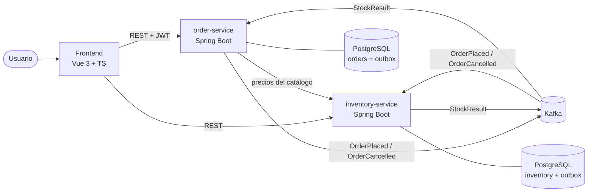
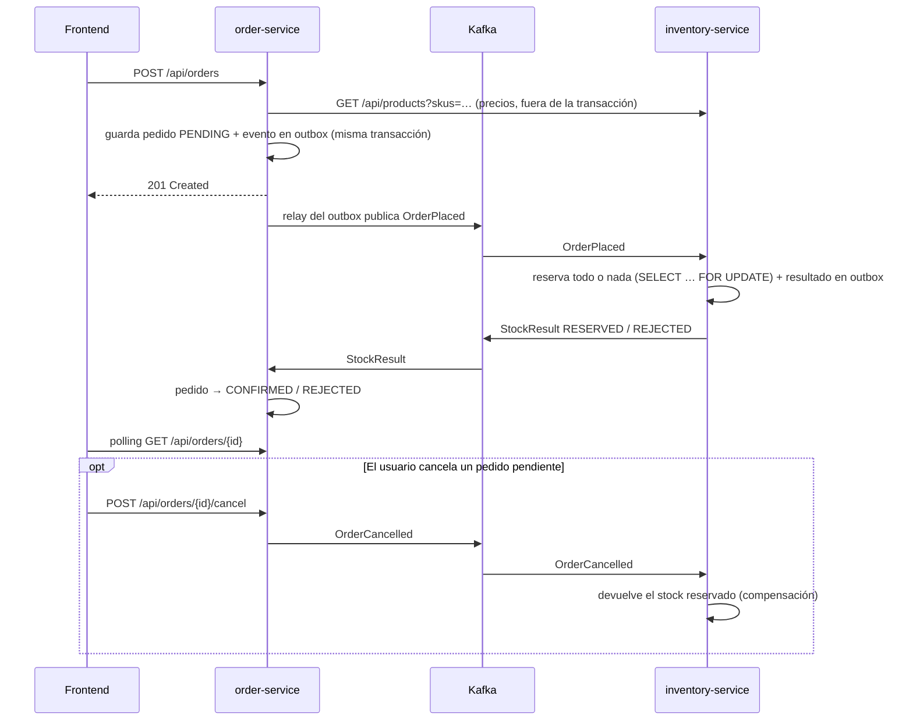

# OrderFlow

[](https://github.com/byVik/orderflow/actions/workflows/ci.yml)


[English](README.md) · **Español**

Gestión de pedidos con **microservicios event-driven**. Un usuario crea un pedido, el servicio de
inventario reserva el stock de forma asíncrona a través de **Kafka** y el pedido pasa a confirmado
o rechazado. Si el usuario cancela, el stock reservado se devuelve. Incluye un frontend en
**Vue 3 + TypeScript**.

Es un proyecto personal para practicar **Spring Boot**, **arquitectura hexagonal / DDD** y
**mensajería con Kafka**, desarrollado con un flujo de **Spec Driven Development asistido por IA**
(ver [Desarrollo con IA](#desarrollo-con-ia-y-sdd)).

| Catálogo | Seguimiento del pedido |
|----------|------------------------|
|  |  |

Más capturas en [docs/screenshots](docs/screenshots/).

---

## Arquitectura



**Flujo de un pedido (saga coreografiada):**



### Arquitectura hexagonal en cada servicio

```
order-service/src/main/java/.../order
├── domain/                  # Modelo y reglas de negocio (sin Spring ni JPA)
│   ├── model/               # Order (agregado), OrderLine, OrderId, OrderStatus
│   └── exception/
├── application/
│   ├── port/in/             # Casos de uso: PlaceOrder, GetOrders, CancelOrder, ApplyStockResult
│   ├── port/out/            # Lo que necesita el núcleo: OrderRepository, OrderEventPublisher, ProductCatalog
│   └── service/             # Implementación de los casos de uso
└── infrastructure/
    ├── adapter/in/web/      # REST (controladores, DTOs, Problem Details)
    ├── adapter/in/messaging/# Listener de Kafka
    ├── adapter/out/persistence/ # JPA + Flyway
    ├── adapter/out/messaging/   # Outbox y relay hacia Kafka
    ├── adapter/out/catalog/     # Cliente REST de inventory-service
    └── config/              # Seguridad, Kafka, OpenAPI, ensamblado de beans
```

El dominio no conoce Spring: los adaptadores dependen del núcleo y nunca al revés. Un test de
**ArchUnit** lo comprueba en cada build.

## Stack

| Capa | Tecnologías |
|------|-------------|
| Backend | Java 21, Spring Boot 3.5, Spring Web, Spring Data JPA / Hibernate, Bean Validation |
| Mensajería | Apache Kafka (KRaft), Spring Kafka, outbox transaccional, reintentos + dead-letter topic |
| Persistencia | PostgreSQL 16, Flyway, base de datos por servicio |
| Seguridad | Spring Security, OAuth2 Resource Server, JWT |
| API | OpenAPI 3 / Swagger UI (springdoc), errores RFC 7807 (Problem Details) |
| Frontend | Vue 3 (Composition API, `<script setup>`), TypeScript, Pinia, Vue Router, Tailwind CSS, Vite |
| Testing | JUnit 5, Mockito, AssertJ, MockMvc, **Testcontainers** (PostgreSQL + Kafka), Awaitility, ArchUnit, Vitest, Vue Test Utils |
| DevOps | Docker multi-stage, Docker Compose, GitHub Actions (CI), JaCoCo |

## Decisiones técnicas

- **Hexagonal + DDD:** el agregado `Order` protege sus invariantes (sin líneas vacías, sin SKUs duplicados, entre 1 y 100 unidades por línea, transiciones de estado válidas). Los casos de uso son interfaces (puertos de entrada) y la infraestructura se enchufa por puertos de salida.
- **El precio lo decide el backend:** el cliente solo envía `sku` y `quantity`. order-service consulta el catálogo, con *timeouts* y **fuera de la transacción** para no retener una conexión a la base de datos durante una llamada HTTP. Si el catálogo no responde: `503`.
- **Outbox transaccional:** guardar en la base de datos y publicar en Kafka son dos escrituras sin transacción común. El evento se inserta en una tabla `outbox` en la misma transacción que el pedido y un *relay* lo publica después (`FOR UPDATE SKIP LOCKED`, espera la confirmación del broker). Ni eventos fantasma ni eventos perdidos. Los puertos no cambiaron: fue un cambio de adaptador.
- **Compensación de la saga:** cancelar publica `OrderCancelled` e inventory devuelve el stock. Como entre topics distintos no hay orden garantizado, si la cancelación llega antes que el pedido queda registrada y ese pedido ya no reserva nada.
- **Idempotencia:** inventory-service guarda cada reserva por `orderId` y lo comprueba después de tomar los bloqueos; la clave primaria es la red de seguridad. order-service ignora resultados para pedidos que ya no están `PENDING`.
- **Sin sobreventa:** la reserva bloquea las filas de producto (`PESSIMISTIC_WRITE`) en orden de SKU para evitar interbloqueos. Es todo o nada, y hay un test con compradores simultáneos.
- **Concurrencia en pedidos:** bloqueo optimista (`@Version`). Si cancelar y confirmar coinciden, gana el primero y el otro recibe un `409`.
- **Orden de eventos:** la clave del mensaje es el `orderId`, así todos los eventos de un pedido van a la misma partición.
- **Errores en consumidores:** 3 reintentos y después el mensaje va a un *dead-letter topic* declarado, dejando un log de error.
- **Seguro por defecto:** el login de demo y su secreto JWT solo existen con el perfil `dev`. Sin perfil, order-service exige `JWT_SECRET` y no expone `/api/auth/token`. En producción los servicios serían resource servers de Keycloak/Auth0.

## Cómo ejecutarlo

### Todo con Docker

```bash
docker compose up --build
```

| Servicio | URL |
|----------|-----|
| Frontend | http://localhost:8080 |
| Swagger order-service | http://localhost:8081/swagger-ui.html |
| Swagger inventory-service | http://localhost:8082/swagger-ui.html |

Entra con cualquier nombre de usuario, añade productos al carrito y haz un pedido. Para ver un
rechazo, pide más unidades del micrófono (`MC-01`, solo hay 3). `docker compose down -v` borra
los datos y deja el catálogo como al principio.

### Modo desarrollo

```bash
docker compose up -d postgres kafka                                   # infraestructura
mvn install -DskipTests                                               # una vez: instala el módulo events
mvn -pl inventory-service spring-boot:run                             # puerto 8082
mvn -pl order-service spring-boot:run -Dspring-boot.run.profiles=dev  # puerto 8081, login de demo
cd frontend && npm install && npm run dev                             # http://localhost:5173 (proxy a los servicios)
```

### Probar la API con curl

```bash
TOKEN=$(curl -s -X POST localhost:8081/api/auth/token \
  -H 'Content-Type: application/json' -d '{"username":"viktor"}' | jq -r .accessToken)

curl -s -X POST localhost:8081/api/orders -H "Authorization: Bearer $TOKEN" \
  -H 'Content-Type: application/json' -d '{"lines":[{"sku":"KB-01","quantity":1}]}'

curl -s localhost:8081/api/orders -H "Authorization: Bearer $TOKEN"
```

## Tests

```bash
mvn test                   # unitarios, web y arquitectura: rápidos, sin Docker
mvn verify                 # además los de integración (necesita Docker para Testcontainers)
cd frontend && npm test    # Vitest
```

- **Dominio:** reglas de los agregados y transiciones de estado.
- **Aplicación:** casos de uso con Mockito (precios del catálogo, propiedad del pedido, idempotencia, compensación).
- **Web:** `@WebMvcTest` con la configuración de seguridad real: tokens válidos, caducados y firmados con otra clave; validación, 401, 404, 409 y 503.
- **Arquitectura:** ArchUnit comprueba que el dominio no depende de frameworks ni de otras capas.
- **Integración:** `@SpringBootTest` con PostgreSQL y Kafka reales en Testcontainers. Prueban el outbox de extremo a extremo, la idempotencia ante duplicados, la liberación de stock (incluida la cancelación que llega antes que el pedido) y que varias reservas simultáneas no venden de más.
- **Frontend:** stores, cliente HTTP, guard del router, sondeo con temporizadores simulados y componentes.

La CI de GitHub Actions ejecuta todo en cada push y construye las imágenes Docker.

## Desarrollo con IA y SDD

El proyecto se ha desarrollado con **Spec Driven Development** y **Claude Code** como asistente:

1. Cada funcionalidad empieza como especificación en [`/specs`](specs/), con reglas y criterios de aceptación.
2. Los criterios se convierten en tests.
3. La implementación se hace con el agente, usando la spec como contexto, y **todo el código se revisa** antes de integrarlo.

Dos ejemplos de cómo se usó el agente más allá de escribir código:

- **Revisión del propio diseño.** Una auditoría con el agente encontró fallos que los tests no cubrían: una cancelación dejaba el stock descontado, y un evento podía perderse si el servicio caía justo tras el commit. La fuga de stock se reprodujo primero contra el sistema en marcha, y los dos se resolvieron con su spec ([004](specs/004-cancelacion-y-liberacion-de-stock.md), [005](specs/005-outbox-transaccional.md)) y sus tests.
- **Diseño de la interfaz.** Las pantallas se prototiparon en **Claude Design** (un lienzo con las cinco vistas, generado desde Claude Code) y después se implementaron en Vue 3 + Tailwind ([spec 006](specs/006-rediseno-interfaz.md)). El resultado se comprobó con capturas automáticas en escritorio y móvil, que son las de este README.

La IA acelera la implementación. Las decisiones de diseño, la revisión y la responsabilidad del
código son mías.

## Próximos pasos

- [ ] Observabilidad: trazas distribuidas a través de Kafka (un pedido seguido de extremo a extremo), Micrometer + Prometheus + Grafana.
- [ ] Endurecer el relay del outbox: acotar la espera del productor cuando Kafka no responde (`max.block.ms`) y purgar las filas ya publicadas.
- [ ] Test de extremo a extremo con Playwright en la CI, sobre `docker compose up`.
- [ ] Paginación en el listado de pedidos.
- [ ] Keycloak como Identity Provider real (RS256, `issuer-uri`).
- [ ] *Circuit breaker* en la consulta de precios, o una copia local de precios alimentada por eventos.
- [ ] Contratos de eventos con Schema Registry (Avro o Protobuf).
- [ ] Herramienta para reprocesar el dead-letter topic.
- [ ] Análisis estático con SonarCloud en la CI.

## Autor

**Viktor Strohush Loyish** · Full Stack Developer (Java · Vue 3)
[LinkedIn](https://www.linkedin.com/in/viktor-strohush-loyish)
