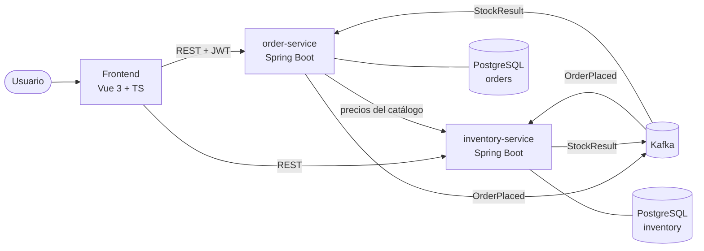
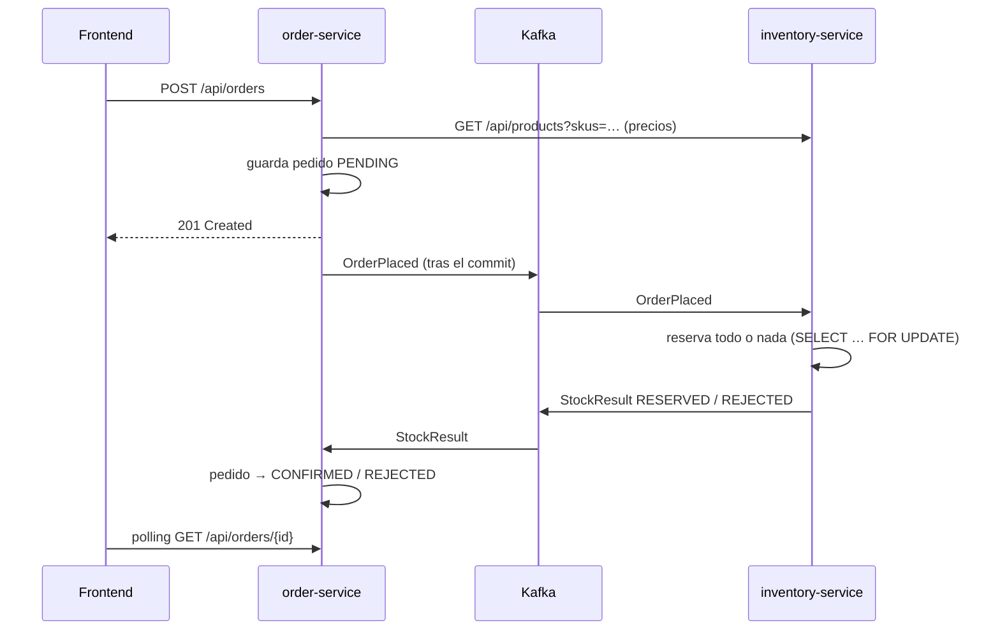

# OrderFlow

[](https://github.com/byVik/orderflow/actions/workflows/ci.yml)


Gestión de pedidos con **microservicios event-driven**. Un usuario crea un pedido, el servicio de
inventario reserva el stock de forma asíncrona a través de **Kafka** y el pedido pasa a confirmado
o rechazado. Incluye un frontend en **Vue 3 + TypeScript**.

Es un proyecto personal para practicar **Spring Boot**, **arquitectura hexagonal / DDD** y
**mensajería con Kafka**, desarrollado con un flujo de **Spec Driven Development asistido por IA**
(ver [Desarrollo con IA](#desarrollo-con-ia-y-sdd)).

---

## Arquitectura



**Flujo de un pedido (saga coreografiada):**



### Arquitectura hexagonal en cada servicio

```
order-service/src/main/java/.../order
├── domain/                  # Modelo y reglas de negocio (sin Spring ni JPA)
│   ├── model/               # Order (agregado), OrderLine, OrderId, OrderStatus
│   └── exception/
├── application/
│   ├── port/in/             # Casos de uso: PlaceOrder, GetOrders, CancelOrder, ApplyStockResult
│   ├── port/out/            # Lo que necesita el núcleo: OrderRepository, OrderEventPublisher, ProductCatalog
│   └── service/             # Implementación de los casos de uso
└── infrastructure/
    ├── adapter/in/web/      # REST (controladores, DTOs, Problem Details)
    ├── adapter/in/messaging/# Listener de Kafka
    ├── adapter/out/persistence/ # JPA + Flyway
    ├── adapter/out/messaging/   # Productor Kafka
    ├── adapter/out/catalog/     # Cliente REST de inventory-service
    └── config/              # Seguridad, Kafka, OpenAPI, ensamblado de beans
```

El dominio no conoce Spring: los adaptadores dependen del núcleo y nunca al revés.

## Stack

| Capa | Tecnologías |
|------|-------------|
| Backend | Java 21, Spring Boot 3.5, Spring Web, Spring Data JPA / Hibernate, Bean Validation |
| Mensajería | Apache Kafka (KRaft), Spring Kafka, reintentos + dead-letter topic |
| Persistencia | PostgreSQL 16, Flyway, base de datos por servicio |
| Seguridad | Spring Security, OAuth2 Resource Server, JWT |
| API | OpenAPI 3 / Swagger UI (springdoc), errores RFC 7807 (Problem Details) |
| Frontend | Vue 3 (Composition API, `<script setup>`), TypeScript, Pinia, Vue Router, Tailwind CSS, Vite |
| Testing | JUnit 5, Mockito, AssertJ, MockMvc, **Testcontainers** (PostgreSQL + Kafka), Awaitility, Vitest, Vue Test Utils |
| DevOps | Docker multi-stage, Docker Compose, GitHub Actions (CI), JaCoCo |

## Decisiones técnicas

- **Hexagonal + DDD:** el agregado `Order` protege sus invariantes (sin líneas vacías, sin SKUs duplicados, transiciones de estado válidas). Los casos de uso son interfaces (puertos de entrada) y la infraestructura se enchufa por puertos de salida.
- **El precio lo decide el backend:** el cliente solo envía `sku` y `quantity`. order-service consulta el catálogo para que nadie pueda manipular precios desde el navegador.
- **Publicación tras el commit:** los eventos se envían en `afterCommit()`, así nunca se anuncia un pedido que no llegó a guardarse.
- **Idempotencia:** inventory-service registra cada `orderId` procesado. Un mensaje duplicado no descuenta stock dos veces y order-service ignora resultados para pedidos que ya no están `PENDING`.
- **Sin sobreventa:** la reserva bloquea las filas de producto (`PESSIMISTIC_WRITE`) en orden de SKU para evitar interbloqueos. Es todo o nada.
- **Orden de eventos:** la clave del mensaje es el `orderId`, así todos los eventos de un pedido van a la misma partición.
- **Errores en consumidores:** 3 reintentos y después el mensaje se envía a un *dead-letter topic*.
- **Auth de demo:** order-service incluye un endpoint `/api/auth/token` (activable por configuración) que emite JWT firmados con HS256, solo para poder probar el proyecto sin montar un Identity Provider. En producción los servicios serían resource servers de Keycloak/Auth0.

## Cómo ejecutarlo

### Todo con Docker

```bash
docker compose up --build
```

| Servicio | URL |
|----------|-----|
| Frontend | http://localhost:8080 |
| Swagger order-service | http://localhost:8081/swagger-ui.html |
| Swagger inventory-service | http://localhost:8082/swagger-ui.html |

Entra con cualquier nombre de usuario, añade productos al carrito y haz un pedido. Para ver un
rechazo, pide más unidades del micrófono (`MC-01`, solo hay 3).

### Modo desarrollo

```bash
docker compose up -d postgres kafka          # infraestructura
mvn -pl order-service -am spring-boot:run    # puerto 8081
mvn -pl inventory-service -am spring-boot:run # puerto 8082
cd frontend && npm install && npm run dev    # http://localhost:5173 (proxy a los servicios)
```

### Probar la API con curl

```bash
TOKEN=$(curl -s -X POST localhost:8081/api/auth/token \
  -H 'Content-Type: application/json' -d '{"username":"viktor"}' | jq -r .accessToken)

curl -s -X POST localhost:8081/api/orders -H "Authorization: Bearer $TOKEN" \
  -H 'Content-Type: application/json' -d '{"lines":[{"sku":"KB-01","quantity":1}]}'

curl -s localhost:8081/api/orders -H "Authorization: Bearer $TOKEN"
```

## Tests

```bash
mvn verify                 # unitarios + integración (necesita Docker para Testcontainers)
cd frontend && npm test    # Vitest
```

- **Dominio:** reglas del agregado y transiciones de estado.
- **Aplicación:** casos de uso con Mockito (precios del catálogo, propiedad del pedido, idempotencia).
- **Web:** `@WebMvcTest` con JWT simulado: validación, 401, 404 y 409.
- **Integración:** `@SpringBootTest` con PostgreSQL y Kafka reales en Testcontainers. Prueban el flujo completo de eventos y la idempotencia ante mensajes duplicados.
- **Frontend:** store del carrito, componentes y cliente HTTP.

La CI de GitHub Actions ejecuta todo en cada push y construye las imágenes Docker.

## Desarrollo con IA y SDD

El proyecto se ha desarrollado con **Spec Driven Development** y **Claude Code** como asistente:

1. Cada funcionalidad empieza como especificación en [`/specs`](specs/), con reglas y criterios de aceptación.
2. Los criterios se convierten en tests.
3. La implementación se hace con el agente, usando la spec como contexto, y **todo el código se revisa** antes de integrarlo.

La IA acelera la implementación. Las decisiones de diseño, la revisión y la responsabilidad del
código son mías.

## Próximos pasos

- [ ] *Transactional outbox* para garantizar la entrega de eventos.
- [ ] Keycloak como Identity Provider real.
- [ ] Liberar stock al cancelar un pedido confirmado.
- [ ] Observabilidad: Micrometer + Prometheus + Grafana y trazas distribuidas.
- [ ] Análisis estático con SonarCloud en la CI.

## Autor

**Viktor Strohush Loyish** · Full Stack Developer (Java · Vue 3)
[LinkedIn](https://www.linkedin.com/in/viktor-strohush-loyish)
