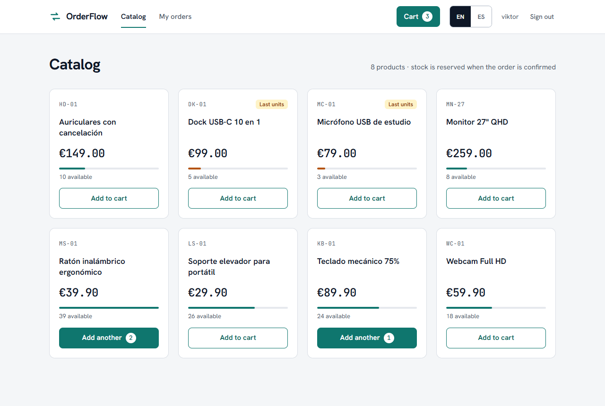
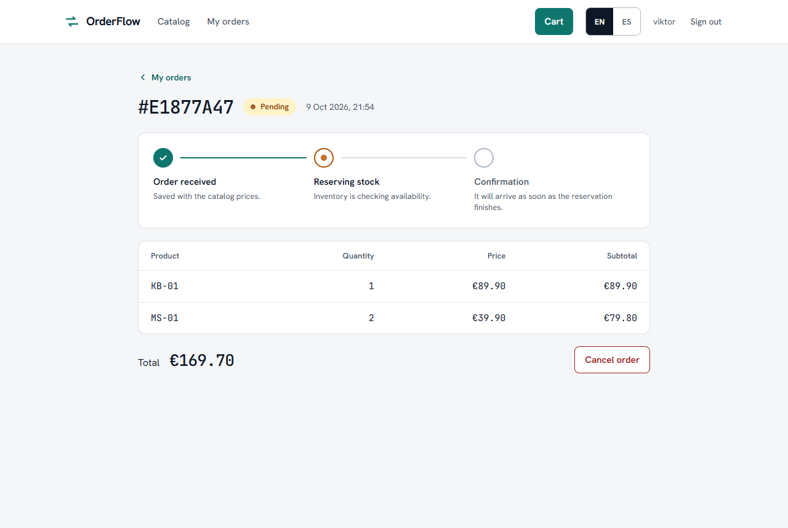
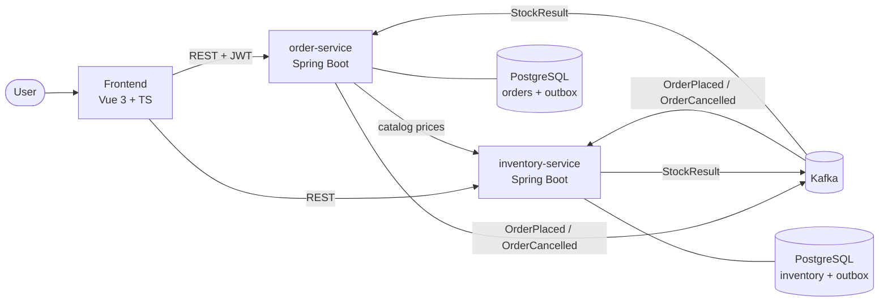
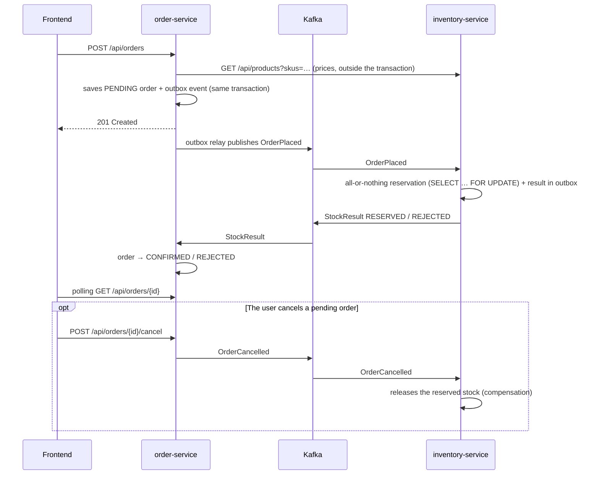

# OrderFlow

[](https://github.com/byVik/orderflow/actions/workflows/ci.yml)


**English** · [Español](README.es.md)

Order management built as **event-driven microservices**. A user places an order, the inventory
service reserves the stock asynchronously through **Kafka**, and the order ends up confirmed or
rejected. If the user cancels, the reserved stock is released. It includes a
**Vue 3 + TypeScript** frontend.

This is a personal project to practice **Spring Boot**, **hexagonal architecture / DDD** and
**messaging with Kafka**, built with an **AI-assisted Spec Driven Development** workflow
(see [AI-assisted development and SDD](#ai-assisted-development-and-sdd)).

| Catalog | Order tracking |
|---------|----------------|
|  |  |

More screenshots in [docs/screenshots](docs/screenshots/). The interface is available in English
and Spanish, with a switch in the header.

---

## Architecture



**Order flow (choreographed saga):**



### Hexagonal architecture in each service

```
order-service/src/main/java/.../order
├── domain/                  # Model and business rules (no Spring, no JPA)
│   ├── model/               # Order (aggregate), OrderLine, OrderId, OrderStatus
│   └── exception/
├── application/
│   ├── port/in/             # Use cases: PlaceOrder, GetOrders, CancelOrder, ApplyStockResult
│   ├── port/out/            # What the core needs: OrderRepository, OrderEventPublisher, ProductCatalog
│   └── service/             # Use case implementations
└── infrastructure/
    ├── adapter/in/web/      # REST (controllers, DTOs, Problem Details)
    ├── adapter/in/messaging/# Kafka listener
    ├── adapter/out/persistence/ # JPA + Flyway
    ├── adapter/out/messaging/   # Outbox and relay to Kafka
    ├── adapter/out/catalog/     # REST client for inventory-service
    └── config/              # Security, Kafka, OpenAPI, bean wiring
```

The domain knows nothing about Spring: adapters depend on the core, never the other way around.
An **ArchUnit** test checks this on every build.

## Stack

| Layer | Technologies |
|-------|--------------|
| Backend | Java 21, Spring Boot 3.5, Spring Web, Spring Data JPA / Hibernate, Bean Validation |
| Messaging | Apache Kafka (KRaft), Spring Kafka, transactional outbox, retries + dead-letter topic |
| Persistence | PostgreSQL 16, Flyway, database per service |
| Security | Spring Security, OAuth2 Resource Server, JWT |
| API | OpenAPI 3 / Swagger UI (springdoc), RFC 7807 errors (Problem Details) with stable error codes |
| Frontend | Vue 3 (Composition API, `<script setup>`), TypeScript, Pinia, Vue Router, vue-i18n (English / Spanish), Tailwind CSS, Vite |
| Testing | JUnit 5, Mockito, AssertJ, MockMvc, **Testcontainers** (PostgreSQL + Kafka), Awaitility, ArchUnit, Vitest, Vue Test Utils |
| DevOps | Multi-stage Docker, Docker Compose, GitHub Actions (CI), JaCoCo |

## Technical decisions

- **Hexagonal + DDD:** the `Order` aggregate protects its invariants (no empty lines, no duplicate SKUs, between 1 and 100 units per line, valid state transitions). Use cases are interfaces (inbound ports) and the infrastructure plugs in through outbound ports.
- **The backend decides the price:** the client only sends `sku` and `quantity`. order-service queries the catalog, with timeouts and **outside the transaction** so that no database connection is held during an HTTP call. If the catalog does not respond: `503`.
- **Transactional outbox:** saving to the database and publishing to Kafka are two writes with no shared transaction. The event is inserted into an `outbox` table in the same transaction as the order, and a relay publishes it afterwards (`FOR UPDATE SKIP LOCKED`, waiting for the broker's acknowledgement). No phantom events and no lost events. The ports did not change: it was an adapter change.
- **Saga compensation:** cancelling publishes `OrderCancelled` and inventory releases the stock. Since there is no ordering guarantee across different topics, a cancellation that arrives before its order is recorded, and that order no longer reserves anything.
- **Idempotency:** inventory-service stores each reservation by `orderId` and checks it after taking the locks; the primary key is the safety net. order-service ignores results for orders that are no longer `PENDING`.
- **No overselling:** the reservation locks the product rows (`PESSIMISTIC_WRITE`) in SKU order to avoid deadlocks. It is all or nothing, and there is a test with concurrent buyers.
- **Concurrency on orders:** optimistic locking (`@Version`). If a cancellation and a confirmation collide, the first one wins and the other gets a `409`.
- **Event ordering:** the message key is the `orderId`, so every event of an order goes to the same partition.
- **Consumer errors:** 3 retries, then the message goes to a declared dead-letter topic and an error is logged.
- **The backend identifies errors, the interface translates them:** every error response carries a stable `code` (plus `params` when the message has data), and the reason an order is rejected is a code too. The interface turns them into text in English or Spanish, and falls back to the English `detail` for a code it does not know. The domain never holds user-facing texts ([spec 007](specs/007-internationalization.md)).
- **Secure by default:** the demo login and its JWT secret only exist with the `dev` profile. Without a profile, order-service requires `JWT_SECRET` and does not expose `/api/auth/token`. In production the services would be resource servers behind Keycloak/Auth0.

## Running it

### Everything with Docker

```bash
docker compose up --build
```

| Service | URL |
|---------|-----|
| Frontend | http://localhost:8080 |
| Swagger order-service | http://localhost:8081/swagger-ui.html |
| Swagger inventory-service | http://localhost:8082/swagger-ui.html |

Sign in with any username, add products to the cart and place an order. To see a rejection, order
more units of the microphone than there are (`MC-01`, only 3 in stock). `docker compose down -v`
wipes the data and resets the catalog.

### Development mode

```bash
docker compose up -d postgres kafka                                   # infrastructure
mvn install -DskipTests                                               # once: installs the events module
mvn -pl inventory-service spring-boot:run                             # port 8082
mvn -pl order-service spring-boot:run -Dspring-boot.run.profiles=dev  # port 8081, demo login
cd frontend && npm install && npm run dev                             # http://localhost:5173 (proxy to the services)
```

### Trying the API with curl

```bash
TOKEN=$(curl -s -X POST localhost:8081/api/auth/token \
  -H 'Content-Type: application/json' -d '{"username":"viktor"}' | jq -r .accessToken)

curl -s -X POST localhost:8081/api/orders -H "Authorization: Bearer $TOKEN" \
  -H 'Content-Type: application/json' -d '{"lines":[{"sku":"KB-01","quantity":1}]}'

curl -s localhost:8081/api/orders -H "Authorization: Bearer $TOKEN"
```

## Tests

```bash
mvn test                   # unit, web and architecture tests: fast, no Docker
mvn verify                 # plus the integration tests (needs Docker for Testcontainers)
cd frontend && npm test    # Vitest
```

- **Domain:** aggregate rules and state transitions.
- **Application:** use cases with Mockito (catalog prices, order ownership, idempotency, compensation).
- **Web:** `@WebMvcTest` with the real security configuration: valid tokens, expired tokens and tokens signed with another key; validation, 401, 404, 409 and 503.
- **Architecture:** ArchUnit checks that the domain does not depend on frameworks or on other layers.
- **Integration:** `@SpringBootTest` with a real PostgreSQL and Kafka in Testcontainers. They test the outbox end to end, idempotency against duplicates, stock release (including a cancellation that arrives before its order) and that concurrent reservations do not oversell.
- **Frontend:** stores, HTTP client, router guard, polling with fake timers, components, and the translation of errors and texts in both languages.

The GitHub Actions CI runs everything on every push and builds the Docker images.

## AI-assisted development and SDD

The project was built with **Spec Driven Development** and **Claude Code** as the assistant:

1. Every feature starts as a specification in [`/specs`](specs/), with rules and acceptance criteria.
2. The criteria become tests.
3. The implementation is done with the agent, using the spec as context, and **all the code is reviewed** before it is merged.

Two examples of how the agent was used beyond writing code:

- **Reviewing my own design.** An audit with the agent found flaws the tests did not cover: a cancellation left the stock deducted, and an event could be lost if the service crashed right after the commit. The stock leak was first reproduced against the running system, and both were fixed with their own spec ([004](specs/004-cancellation-and-stock-release.md), [005](specs/005-transactional-outbox.md)) and tests.
- **Interface design.** The screens were prototyped in **Claude Design** (a canvas with the five views, generated from Claude Code) and then implemented in Vue 3 + Tailwind ([spec 006](specs/006-interface-redesign.md)). The result was checked with automated screenshots on desktop and mobile, which are the ones in this README.

AI speeds up the implementation. The design decisions, the review and the responsibility for the
code are mine.

## Next steps

- [ ] Observability: distributed tracing across Kafka (one order followed end to end), Micrometer + Prometheus + Grafana.
- [ ] Harden the outbox relay: bound the producer's wait when Kafka does not respond (`max.block.ms`) and purge rows that are already published.
- [ ] End-to-end test with Playwright in CI, on top of `docker compose up`.
- [ ] Pagination in the order list.
- [ ] Keycloak as a real Identity Provider (RS256, `issuer-uri`).
- [ ] Circuit breaker on the price lookup, or a local copy of prices fed by events.
- [ ] Event contracts with Schema Registry (Avro or Protobuf).
- [ ] A tool to reprocess the dead-letter topic.
- [ ] Static analysis with SonarCloud in CI.

## Author

**Viktor Strohush Loyish** · Full Stack Developer (Java · Vue 3)
[LinkedIn](https://www.linkedin.com/in/viktor-strohush-loyish)
